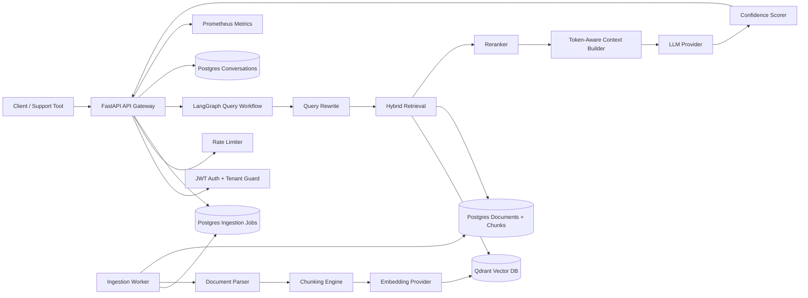
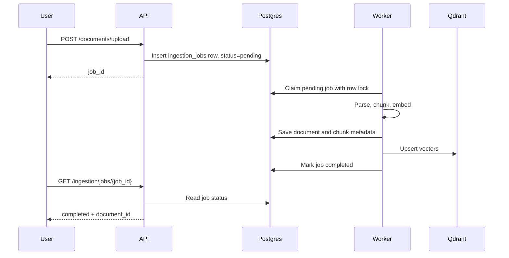
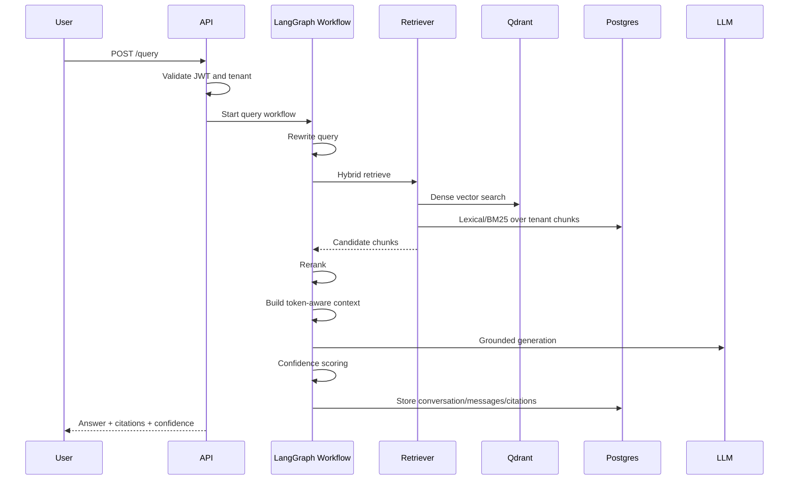

# Enterprise AI Support Copilot Backend

Production-grade backend for a multi-tenant AI support copilot. The system ingests enterprise
knowledge sources, indexes them through a Retrieval-Augmented Generation pipeline, and answers
support questions with citations, confidence scoring, durable ingestion jobs, authentication, and
observability.

This project is designed to demonstrate real backend and AI infrastructure engineering rather than a
tutorial chatbot or a simple "chat with PDF" application.

## Why This Project Matters

Enterprise support copilots need more than an LLM prompt. They need secure tenant isolation, durable
document ingestion, vector search, lexical retrieval, reranking, grounded generation, confidence
fallbacks, audit-friendly persistence, and production observability.

This codebase implements those concerns as separate, extensible backend layers.

## Highlights

- **FastAPI backend** with typed Pydantic v2 request/response schemas.
- **JWT authentication** with tenant-scoped users and password hashing.
- **Postgres persistence** for tenants, users, documents, chunks, conversations, messages, citations,
  and ingestion jobs.
- **Alembic migrations** for controlled database schema evolution.
- **Durable Postgres-backed ingestion queue** with worker-side job claiming and retry state.
- **LangGraph orchestration** for the query workflow.
- **Hybrid retrieval** using vector search plus BM25-style lexical scoring.
- **Reranking layer** to improve retrieval precision.
- **Token-aware context builder** with citation preservation.
- **Confidence scoring and safe fallback** to reduce hallucinated answers.
- **Provider abstraction layer** for LLMs, embeddings, rerankers, and vector databases.
- **Qdrant vector database support** with tenant-aware payload filtering.
- **Prometheus metrics** and Docker Compose infrastructure.
- **PDM-managed Python project** with linting and tests.

## Tech Stack

| Area | Technology |
| --- | --- |
| API | FastAPI, Uvicorn |
| Language | Python 3.12+ |
| Package manager | PDM |
| Data validation | Pydantic v2 |
| Workflow orchestration | LangGraph |
| Relational database | PostgreSQL |
| Migrations | Alembic |
| Vector database | Qdrant |
| Cache service | Redis-ready architecture |
| Local LLM | Ollama |
| LLM providers | Ollama, OpenAI-compatible providers, OpenRouter, Groq |
| Embeddings | Local deterministic embeddings, Ollama embeddings |
| Observability | Prometheus metrics, Grafana/Prometheus Compose stack |
| Testing | pytest, pytest-asyncio |
| Containers | Docker, Docker Compose |

## Supported Knowledge Sources

| Source | Status |
| --- | --- |
| PDF | Supported via `pypdf` |
| DOCX | Supported via `python-docx` |
| Markdown | Supported |
| Plain text | Supported |
| URL / HTML page | Supported via `httpx` and BeautifulSoup |
| Unknown file extension | Text fallback |

Future source adapters can be added for Confluence, Notion, Google Drive, Slack, Zendesk, CSV, PPTX,
XLSX, and OCR pipelines.

## System Architecture



## Ingestion Flow

Uploads and URL ingestion are asynchronous. The API does not parse and index large documents inside
the request lifecycle.



Durability behavior:

- Jobs are persisted in Postgres.
- Workers claim jobs with row locking.
- Failed jobs retain error details.
- Retry state is stored with each job.
- API and worker can scale independently.

## Query Flow



If the system cannot retrieve reliable evidence, it returns a safe fallback:

```text
I could not find reliable information in the knowledge base.
```

## Security Model

Implemented:

- JWT bearer authentication.
- Password hashing with PBKDF2-HMAC-SHA256 and random salts.
- Tenant-scoped users.
- Protected ingestion, query, document, and conversation endpoints.
- Tenant mismatch protection.
- Prompt injection pattern detection.
- Request validation through Pydantic.
- Rate limiting hook.

The API derives tenant authority from the signed token, not from user-controlled headers alone.

## Persistence Model

Postgres stores:

- `tenants`
- `users`
- `documents`
- `document_chunks`
- `conversations`
- `conversation_messages`
- `ingestion_jobs`
- Alembic version history

Qdrant stores:

- chunk embeddings
- chunk payload metadata
- tenant filters for vector search

## Database Migrations

Migrations are managed by Alembic.

```bash
pdm run migrate
```

Current migrations:

- `20260509_0001_initial_schema.py`
- `20260509_0002_ingestion_jobs.py`

For local development, the app can run migrations on startup using:

```bash
AUTO_RUN_MIGRATIONS=true
```

For production, run migrations as a release step before deploying new API/worker containers.

## API Surface

| Endpoint | Purpose |
| --- | --- |
| `POST /auth/register` | Register tenant user and receive access token |
| `POST /auth/token` | Login and receive access token |
| `GET /auth/me` | Inspect current authenticated user |
| `POST /documents/upload` | Enqueue file ingestion job |
| `POST /documents/url` | Enqueue URL ingestion job |
| `GET /ingestion/jobs/{job_id}` | Check durable ingestion job status |
| `DELETE /documents/{id}` | Delete document for current tenant |
| `POST /query` | Ask a grounded question |
| `GET /conversations/{id}` | Fetch conversation history |
| `GET /health` | Service health and provider status |
| `GET /metrics` | Prometheus metrics |

Interactive docs are available at:

```text
http://localhost:8000/docs
```

## Quick Start

Install dependencies:

```bash
pdm install -G dev
```

Start the full local stack:

```bash
docker compose up --build
```

Run migrations manually if needed:

```bash
pdm run migrate
```

Start only the API locally:

```bash
pdm run uvicorn ai_support_copilot.api.main:app --host 127.0.0.1 --port 8000
```

Start only the worker locally:

```bash
pdm run worker
```

## End-to-End Example

Register and store a token:

```bash
TOKEN=$(curl -s -X POST http://localhost:8000/auth/register \
  -H "Content-Type: application/json" \
  -d '{"tenant_id":"acme","email":"admin@acme.test","password":"VerySecurePassword123!"}' \
  | python3 -c 'import json,sys; print(json.load(sys.stdin)["access_token"])')
```

Upload a sample runbook:

```bash
JOB_ID=$(curl -s -H "Authorization: Bearer $TOKEN" \
  -F tenant_id=acme \
  -F file=@examples/data/acme_runbook.md \
  http://localhost:8000/documents/upload \
  | python3 -c 'import json,sys; print(json.load(sys.stdin)["job_id"])')
```

Check ingestion status:

```bash
curl -s -H "Authorization: Bearer $TOKEN" \
  http://localhost:8000/ingestion/jobs/$JOB_ID
```

Ask a question:

```bash
curl -s -X POST http://localhost:8000/query \
  -H "Authorization: Bearer $TOKEN" \
  -H "Content-Type: application/json" \
  -d '{"tenant_id":"acme","query":"Why are enterprise card payments failing?","top_k":6}'
```

## Local Provider Modes

Fast local development:

```bash
LLM_PROVIDER=fake
EMBEDDING_PROVIDER=local
VECTOR_STORE_PROVIDER=memory
```

Local RAG with Qdrant:

```bash
LLM_PROVIDER=ollama
EMBEDDING_PROVIDER=local
VECTOR_STORE_PROVIDER=qdrant
```

Fully local model path:

```bash
LLM_PROVIDER=ollama
EMBEDDING_PROVIDER=ollama
VECTOR_STORE_PROVIDER=qdrant
```

Anthropic model through an OpenAI-compatible gateway:

```bash
LLM_PROVIDER=anthropic
ANTHROPIC_OPENAI_BASE_URL=https://openrouter.ai/api/v1
ANTHROPIC_OPENAI_API_KEY=<gateway-api-key>
ANTHROPIC_CHAT_MODEL=anthropic/claude-3.5-sonnet
```

## Configuration

Copy the example environment file:

```bash
cp .env.example .env
```

Important variables:

| Variable | Purpose |
| --- | --- |
| `POSTGRES_DSN` | SQLAlchemy async Postgres connection string |
| `QDRANT_URL` | Vector database endpoint |
| `REDIS_URL` | Redis endpoint for cache-ready infrastructure |
| `AUTH_JWT_SECRET` | JWT signing secret |
| `LLM_PROVIDER` | `fake`, `ollama`, `openai`, `anthropic`, `openrouter`, `groq` |
| `EMBEDDING_PROVIDER` | `local`, `ollama`, extension providers |
| `VECTOR_STORE_PROVIDER` | `memory`, `qdrant`, extension stores |
| `CONFIDENCE_THRESHOLD` | Minimum confidence before fallback |
| `AUTO_RUN_MIGRATIONS` | Run Alembic migrations on app startup |

## Provider Support

The implemented local path supports Ollama chat, Ollama embeddings, deterministic local embeddings,
Qdrant vector search, an in-memory vector store for tests, and Postgres-backed repositories.
OpenAI-compatible chat providers are also supported, including OpenAI-style APIs, OpenRouter, Groq,
and Anthropic models served through an OpenAI-compatible gateway such as OpenRouter or LiteLLM. The
vector database layer is intentionally abstracted so additional adapters can be added without changing
ingestion or query orchestration.

## Testing and Quality

```bash
pdm run format
pdm run lint
pdm run test
```

Current tests cover:

- API health.
- Authentication registration/login/protected route behavior.
- Tenant mismatch protection.
- Durable ingestion job enqueue and worker processing.
- Chunking behavior.
- Confidence scoring.
- Tenant-scoped retrieval.

## Observability

Prometheus metrics are exposed at:

```text
GET /metrics
```

Tracked metric categories include:

- HTTP request count.
- HTTP request latency.
- Query latency.
- Ingestion status counts.

Docker Compose includes Prometheus and Grafana wiring for local monitoring.

## Repository Structure

```text
src/ai_support_copilot/
  api/                 FastAPI app and dependency container
  core/                configuration, logging, errors
  domain/              Pydantic domain models
  observability/       Prometheus metrics
  providers/           LLM, embedding, reranker, vector store adapters
  repositories/        SQLAlchemy, Alembic, Postgres repositories
  security/            JWT auth, password hashing, rate limit, prompt guard
  services/            ingestion, chunking, retrieval, context, confidence
  workflows/           LangGraph query workflow
  workers/             durable ingestion worker
alembic/               migration environment and revisions
docs/                  architecture and setup guides
tests/                 API and unit tests
```

## Production Hardening Roadmap

High-value next steps:

- Replace polling worker with Celery/RabbitMQ, Dramatiq, SQS, or Kafka for higher throughput.
- Add Redis-backed semantic cache implementation.
- Add refresh tokens and token revocation.
- Add OpenTelemetry tracing and Langfuse/LangSmith spans.
- Add managed reranker support such as Cohere or a local cross-encoder.
- Add load tests and ingestion benchmarks.
- Add object storage for large uploaded source files instead of storing file payloads in Postgres.
- Add admin APIs for tenants, users, document lifecycle, and ingestion job management.
