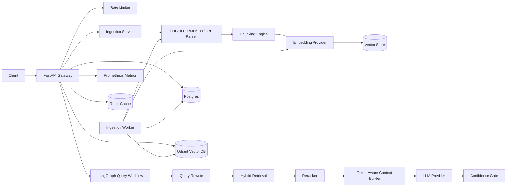

# Architecture

## Key Boundaries

- API layer owns validation, rate limiting, streaming response shape, tenant headers, and OpenAPI.
- Service layer owns ingestion, parsing, chunking, retrieval, context packing, and confidence scoring.
- Provider layer isolates LLM, embedding, reranker, and vector database implementations.
- Repository layer persists tenants, users, documents, chunks, conversations, messages, and citations
  in Postgres through SQLAlchemy async repositories.
- Ingestion jobs are durable Postgres rows. API requests enqueue jobs, and workers atomically claim
  pending jobs, process them, update retry/status fields, and write document/chunk metadata.
- Workflow layer uses LangGraph so retrieval and generation nodes can evolve into durable agent workflows.

## Multi-Tenancy

Every user, document, chunk, conversation, message, and vector search request carries `tenant_id`.
Protected API routes derive tenant authority from the JWT bearer token, not from user-controlled
headers. Qdrant uses payload filters; the in-memory test vector store filters before scoring.

## Production Follow-Ups

- Run Alembic migrations as an explicit deployment/release step before new API containers start.
- Move ingestion jobs to Celery/RabbitMQ or Kafka when throughput requires independent scaling.
- Add OpenTelemetry traces and Langfuse/LangSmith spans around provider calls.
- Add managed reranker integrations such as Cohere or a local cross-encoder model.
